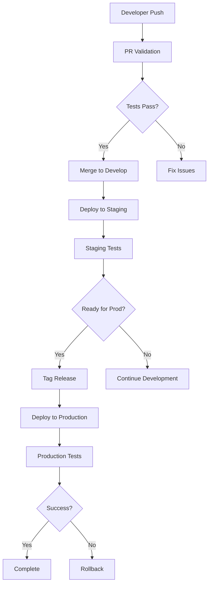

# CI/CD Pipeline Documentation

## Overview

The SOC Compliance Platform uses a comprehensive CI/CD pipeline built with GitHub Actions to ensure code quality, security, and reliable deployments across all environments.

## Pipeline Architecture



## Workflows

### 1. PR Validation (`pr-validation.yml`)

**Trigger**: Pull requests to `main` or `develop` branches

**Purpose**: Validate code quality and ensure all tests pass before merging

**Jobs**:
- **Change Detection**: Identifies which services/components have changed
- **Code Quality**: Runs ESLint, Prettier, and TypeScript checks
- **Unit Tests**: Runs tests for affected services with coverage reporting
- **Security Scans**: Checks for secrets and vulnerabilities
- **Docker Build**: Validates Docker images can be built
- **PR Comment**: Posts validation results as a comment

**Key Features**:
- Parallel execution for faster feedback
- Conditional testing based on changed files
- Automated PR status comments
- Coverage reporting to Codecov

### 2. Deploy to Staging (`deploy-staging.yml`)

**Trigger**: 
- Push to `develop` branch
- Manual workflow dispatch

**Purpose**: Automatically deploy latest changes to staging environment

**Jobs**:
- **Build and Push Images**: Creates Docker images and pushes to registry
- **Run Migrations**: Applies database migrations
- **Deploy Services**: Updates Kubernetes deployments
- **Smoke Tests**: Validates deployment health
- **Notifications**: Sends deployment status to Slack

**Key Features**:
- Incremental deployments
- Automatic rollback on failure
- Health checks and smoke tests
- Deployment notifications

### 3. Deploy to Production (`deploy-production.yml`)

**Trigger**:
- Push of semantic version tags (v*)
- Manual workflow dispatch with version input

**Purpose**: Controlled deployment to production with safety checks

**Jobs**:
- **Pre-deployment Checks**: Verifies version and security
- **Manual Approval**: Requires human approval
- **Database Backup**: Creates full backup before deployment
- **Rolling Deployment**: Deploys services in groups
- **Production Tests**: Runs comprehensive test suite
- **Update Monitoring**: Updates monitoring systems
- **Finalize**: Creates release notes and notifications

**Key Features**:
- Multi-stage deployment with approval gates
- Automatic database backups
- Canary deployments
- Comprehensive rollback capability
- Integration with monitoring systems

### 4. Security Scanning (`security-scan.yml`)

**Trigger**:
- Push to main branches
- Daily schedule (2 AM UTC)
- Manual workflow dispatch

**Purpose**: Continuous security monitoring and vulnerability detection

**Jobs**:
- **Dependency Scan**: Checks npm packages for vulnerabilities
- **Code Security**: Static analysis with CodeQL and Semgrep
- **Secret Detection**: Scans for exposed credentials
- **Container Scan**: Analyzes Docker images
- **Infrastructure Scan**: Reviews Terraform and K8s configs
- **Compliance Check**: License and SBOM generation

**Tools Used**:
- Snyk
- CodeQL
- Semgrep
- Gitleaks
- TruffleHog
- Trivy
- OWASP Dependency Check

### 5. Dependency Updates (`dependency-update.yml`)

**Trigger**:
- Weekly schedule (Mondays at 6 AM UTC)
- Manual workflow dispatch

**Purpose**: Automated dependency management and updates

**Jobs**:
- **NPM Updates**: Updates JavaScript dependencies
- **Docker Base Images**: Updates container base images
- **GitHub Actions**: Updates workflow actions
- **Security Audit**: Comprehensive vulnerability report

**Features**:
- Automated PR creation
- Test validation before PR
- Grouped updates by type
- Security-first approach

## Environment Configuration

### Staging Environment

- **Namespace**: `soc-staging`
- **Domain**: `staging.soc-platform.com`
- **Features**:
  - Debug endpoints enabled
  - Mock integrations available
  - Reduced resource allocation
  - Test data seeding

### Production Environment

- **Namespace**: `soc-production`
- **Domain**: `soc-platform.com`
- **Features**:
  - High availability configuration
  - Auto-scaling enabled
  - Full monitoring and alerting
  - Disaster recovery setup

## Secret Management

### Required GitHub Secrets

**Registry Access**:
- `GITHUB_TOKEN` (automatically provided)

**Kubernetes Access**:
- `STAGING_KUBECONFIG`
- `PROD_KUBECONFIG`

**Database Credentials**:
- `STAGING_DB_HOST`
- `STAGING_DB_USERNAME`
- `STAGING_DB_PASSWORD`
- `PROD_DB_HOST`
- `PROD_DB_USERNAME`
- `PROD_DB_PASSWORD`

**External Services**:
- `SNYK_TOKEN`
- `FOSSA_API_KEY`
- `SENDGRID_API_KEY`
- `OPENAI_API_KEY`
- `DATADOG_API_KEY`
- `PAGERDUTY_TOKEN`
- `SLACK_WEBHOOK_URL`

**Backup Storage**:
- `PROD_BACKUP_BUCKET`
- `AWS_ACCESS_KEY_ID`
- `AWS_SECRET_ACCESS_KEY`

## Deployment Process

### Development Workflow

1. Create feature branch from `develop`
2. Make changes and push commits
3. Open PR to `develop`
4. PR validation runs automatically
5. Address any failing checks
6. Merge after approval
7. Automatic deployment to staging

### Production Release

1. Ensure staging is stable
2. Create release branch from `develop`
3. Update version numbers
4. Create PR to `main`
5. After merge, tag with version
6. Production deployment triggers
7. Monitor deployment progress
8. Verify production health

## Monitoring and Alerts

### Deployment Monitoring

- **Slack Notifications**: All deployment events
- **Datadog Events**: Deployment markers
- **PagerDuty**: Critical failure alerts
- **GitHub Deployments**: Status tracking

### Health Checks

- Service-level health endpoints
- Kubernetes readiness/liveness probes
- Synthetic monitoring tests
- Performance benchmarks

## Rollback Procedures

### Automatic Rollback

Triggered when:
- Health checks fail
- Smoke tests fail
- Error rate exceeds threshold

### Manual Rollback

```bash
# Staging rollback
helm rollback soc-platform --namespace soc-staging

# Production rollback
helm rollback soc-platform-1 --namespace soc-production
helm rollback soc-platform-2 --namespace soc-production
helm rollback soc-platform-3 --namespace soc-production
```

## Best Practices

### Code Quality

1. **Pre-commit Hooks**: Run linters locally
2. **Test Coverage**: Maintain >80% coverage
3. **Type Safety**: No TypeScript errors
4. **Documentation**: Update with code changes

### Security

1. **No Secrets in Code**: Use environment variables
2. **Dependency Updates**: Weekly automated checks
3. **Container Scanning**: Every build
4. **SAST/DAST**: Continuous scanning

### Deployment Safety

1. **Feature Flags**: Control rollout
2. **Canary Deployments**: Gradual rollout
3. **Database Backups**: Before every deployment
4. **Rollback Plan**: Always prepared

## Troubleshooting

### Common Issues

**PR Validation Failures**:
- Check specific job logs
- Ensure dependencies are installed
- Verify test database setup
- Review linting errors

**Deployment Failures**:
- Check Kubernetes events: `kubectl get events -n <namespace>`
- Review pod logs: `kubectl logs -n <namespace> <pod>`
- Verify secrets are set correctly
- Check resource availability

**Rollback Issues**:
- Ensure Helm history exists
- Verify database compatibility
- Check for breaking changes
- Review deployment events

### Debug Commands

```bash
# Check workflow runs
gh run list --workflow=pr-validation.yml

# View workflow logs
gh run view <run-id> --log

# Check deployment status
kubectl get deployments -n soc-staging
kubectl describe deployment <name> -n soc-staging

# View recent events
kubectl get events -n soc-staging --sort-by='.lastTimestamp'
```

## Performance Metrics

### Pipeline Performance Targets

- **PR Validation**: < 15 minutes
- **Staging Deployment**: < 10 minutes
- **Production Deployment**: < 30 minutes
- **Rollback Time**: < 5 minutes

### Optimization Strategies

1. **Parallel Execution**: Run independent jobs concurrently
2. **Caching**: Cache dependencies and Docker layers
3. **Conditional Builds**: Only build changed services
4. **Resource Allocation**: Appropriate runner sizes

## Future Improvements

### Planned Enhancements

1. **Blue-Green Deployments**: Zero-downtime deployments
2. **A/B Testing**: Feature experimentation
3. **GitOps**: ArgoCD integration
4. **Multi-Region**: Cross-region deployments
5. **Advanced Monitoring**: APM integration

### Automation Opportunities

1. **Auto-remediation**: Self-healing deployments
2. **Performance Testing**: Automated load tests
3. **Chaos Engineering**: Resilience testing
4. **Cost Optimization**: Resource right-sizing

## References

- [GitHub Actions Documentation](https://docs.github.com/en/actions)
- [Kubernetes Documentation](https://kubernetes.io/docs/)
- [Helm Documentation](https://helm.sh/docs/)
- [Docker Documentation](https://docs.docker.com/)

## Support

For CI/CD issues or questions:
1. Check this documentation
2. Review workflow logs
3. Contact DevOps team
4. Create issue in repository