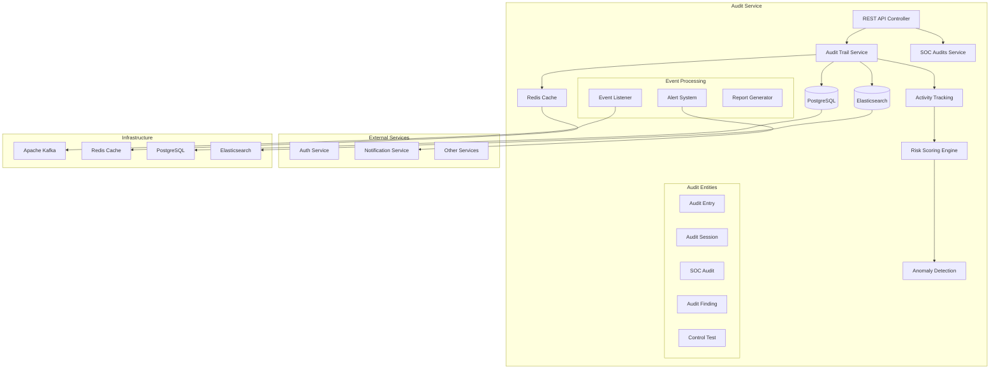

# Audit Service

[](./src)
[]()
[](./tsconfig.json)
[](./docs)

The Audit Service is a comprehensive, enterprise-grade microservice built with NestJS that provides complete audit trail functionality, SOC compliance auditing, activity tracking with risk scoring, and anomaly detection for the SOC Compliance Platform.

## Table of Contents

- [Features](#features)
- [Architecture](#architecture)
- [Quick Start](#quick-start)
- [Configuration](#configuration)
- [API Documentation](#api-documentation)
- [Activity Tracking & Analytics](#activity-tracking--analytics)
- [Risk Scoring & Anomaly Detection](#risk-scoring--anomaly-detection)
- [SOC Compliance Features](#soc-compliance-features)
- [Testing](#testing)
- [Production Deployment](#production-deployment)
- [Contributing](#contributing)

## Features

### Core Capabilities
- **Comprehensive Audit Trail**: Complete activity logging across all platform services
- **SOC Compliance Auditing**: SOC 1 and SOC 2 audit management and reporting
- **Activity Tracking**: Real-time user and system activity monitoring
- **Risk Scoring**: Intelligent risk assessment for all audit events
- **Anomaly Detection**: Machine learning-based anomaly detection and alerting
- **Session Management**: User session tracking with complete lifecycle management
- **Compliance Reporting**: Automated compliance reports and audit evidence
- **Event Correlation**: Cross-service event correlation and timeline reconstruction

### Enterprise Features
- **Redis Caching**: High-performance caching for audit queries and analytics
- **Kafka Integration**: Event-driven architecture for real-time audit streaming
- **Elasticsearch Integration**: Full-text search and advanced analytics
- **Health Monitoring**: Comprehensive health checks for all dependencies
- **Observability**: OpenTelemetry integration with distributed tracing
- **Security**: JWT authentication, role-based access control, and audit encryption
- **Scalability**: Horizontal scaling with load balancing support

### Analytics & Reporting
- **Risk Analytics**: Real-time risk scoring and trend analysis
- **Compliance Metrics**: SOC 1/SOC 2 compliance tracking and reporting
- **Activity Intelligence**: User behavior analytics and pattern recognition
- **Audit Intelligence**: Automated audit findings and recommendations
- **Performance Monitoring**: System performance impact analysis

## Architecture



### Key Components

#### Entities
- **AuditEntry**: Core audit trail entries with full metadata
- **AuditSession**: User session tracking with activity correlation
- **SocAudit**: SOC 1/SOC 2 compliance audit management
- **AuditFinding**: Audit findings and recommendations
- **ControlTest**: Control testing and validation results

#### Services
- **AuditTrailService**: Core audit trail management and activity tracking
- **SocAuditsService**: SOC compliance audit lifecycle management
- **AuditIntegrationService**: Cross-service audit correlation
- **FindingsService**: Audit findings management and reporting
- **EventsService**: Real-time event processing and streaming

#### Advanced Features
- **Risk Scoring Engine**: Intelligent risk assessment for all activities
- **Anomaly Detection**: ML-based detection of suspicious patterns
- **Activity Intelligence**: User behavior analytics and insights
- **Compliance Automation**: Automated compliance checks and reporting

## Quick Start

### Prerequisites
- Node.js 18+
- PostgreSQL 13+
- Redis 6+
- Elasticsearch 8+
- Kafka (for event streaming)

### Development Setup

1. **Install Dependencies**
   ```bash
   cd services/audit-service
   npm install
   ```

2. **Environment Configuration**
   ```bash
   cp .env.example .env
   # Edit .env with your configuration
   ```

3. **Database Setup**
   ```bash
   # Run migrations
   npm run migration:run
   ```

4. **Start Infrastructure**
   ```bash
   # Start Docker services
   docker-compose up -d postgres redis kafka elasticsearch
   ```

5. **Start Development Server**
   ```bash
   npm run start:dev
   ```

The service will be available at `http://localhost:3008`

### Docker Deployment

```dockerfile
# Build and run with Docker
docker build -t audit-service .
docker run -p 3008:3008 audit-service
```

## Configuration

### Environment Variables

```bash
# Server Configuration
PORT=3008
NODE_ENV=development
SERVICE_NAME=audit-service

# Database
DATABASE_HOST=127.0.0.1
DATABASE_PORT=5432
DATABASE_NAME=soc_audits
DATABASE_USERNAME=soc_user
DATABASE_PASSWORD=soc_pass
DATABASE_SSL=false

# Redis
REDIS_HOST=127.0.0.1
REDIS_PORT=6379
REDIS_PASSWORD=soc_redis_pass

# Elasticsearch
ELASTICSEARCH_URL=http://127.0.0.1:9200
ELASTICSEARCH_INDEX_PREFIX=soc_audit

# Kafka
KAFKA_BROKER=127.0.0.1:9092
KAFKA_CLIENT_ID=audit-service

# Risk Scoring
RISK_SCORING_ENABLED=true
ANOMALY_DETECTION_ENABLED=true
RISK_THRESHOLD_HIGH=80
RISK_THRESHOLD_MEDIUM=50

# Compliance
SOC1_ENABLED=true
SOC2_ENABLED=true
COMPLIANCE_REPORTING_ENABLED=true
```

### Service Configuration

```typescript
// config/configuration.ts
export default () => ({
  app: {
    port: parseInt(process.env.PORT, 10) || 3008,
    env: process.env.NODE_ENV || 'development',
    name: 'audit-service',
  },
  database: {
    host: process.env.DATABASE_HOST || '127.0.0.1',
    port: parseInt(process.env.DATABASE_PORT, 10) || 5432,
    name: process.env.DATABASE_NAME || 'soc_audits',
    username: process.env.DATABASE_USERNAME || 'soc_user',
    password: process.env.DATABASE_PASSWORD || 'soc_pass',
    ssl: process.env.DATABASE_SSL === 'true',
  },
  riskScoring: {
    enabled: process.env.RISK_SCORING_ENABLED === 'true',
    highThreshold: parseInt(process.env.RISK_THRESHOLD_HIGH, 10) || 80,
    mediumThreshold: parseInt(process.env.RISK_THRESHOLD_MEDIUM, 10) || 50,
    anomalyDetection: process.env.ANOMALY_DETECTION_ENABLED === 'true',
  },
  compliance: {
    soc1Enabled: process.env.SOC1_ENABLED === 'true',
    soc2Enabled: process.env.SOC2_ENABLED === 'true',
    reportingEnabled: process.env.COMPLIANCE_REPORTING_ENABLED === 'true',
  },
});
```

## API Documentation

### Audit Trail Endpoints

#### Create Audit Entry
```http
POST /api/audit-trail/entries
Content-Type: application/json
Authorization: Bearer <jwt-token>

{
  "action": "login",
  "resource": "auth",
  "userId": "user-uuid",
  "organizationId": "org-uuid",
  "details": {
    "ipAddress": "192.168.1.100",
    "userAgent": "Mozilla/5.0...",
    "location": "New York, NY"
  },
  "severity": "info",
  "context": {
    "sessionId": "session-uuid",
    "requestId": "request-uuid"
  }
}
```

#### Search Audit Entries
```http
GET /api/audit-trail/entries/search?action=login&severity=high&startDate=2025-01-01&endDate=2025-01-31&limit=100
Authorization: Bearer <jwt-token>
```

#### Get Audit Report
```http
POST /api/audit-trail/reports
Content-Type: application/json
Authorization: Bearer <jwt-token>

{
  "type": "compliance",
  "format": "pdf",
  "dateRange": {
    "start": "2025-01-01T00:00:00Z",
    "end": "2025-01-31T23:59:59Z"
  },
  "filters": {
    "severity": ["high", "critical"],
    "resources": ["user_management", "data_access"]
  }
}
```

### SOC Audit Endpoints

#### Create SOC Audit
```http
POST /api/soc-audits
Content-Type: application/json
Authorization: Bearer <jwt-token>

{
  "name": "Q1 2025 SOC 2 Type II Audit",
  "type": "soc2_type2",
  "description": "Quarterly SOC 2 Type II compliance audit",
  "auditPeriod": {
    "start": "2025-01-01T00:00:00Z",
    "end": "2025-03-31T23:59:59Z"
  },
  "auditorId": "auditor-uuid",
  "scope": {
    "services": ["auth", "data", "processing"],
    "controls": ["CC1.1", "CC2.1", "CC3.1"]
  }
}
```

#### Get Audit Activity Analysis
```http
GET /api/audit-trail/activity-analysis/{userId}?timeframe=30d&includeRiskScore=true
Authorization: Bearer <jwt-token>
```

## Activity Tracking & Analytics

### Comprehensive Activity Tracking

The Audit Service provides enterprise-grade activity tracking with the following capabilities:

#### Real-Time Activity Monitoring
```typescript
// Automatic activity tracking via decorators
@Audit({
  action: AuditAction.CREATE,
  resource: AuditResource.USER,
  severity: AuditSeverity.INFO
})
async createUser(userData: CreateUserDto): Promise<User> {
  // User creation logic
  // Audit entry automatically created with:
  // - Action: CREATE
  // - Resource: USER  
  // - Timestamp: Current time
  // - User context: From JWT
  // - Risk score: Calculated automatically
}
```

#### Session Activity Correlation
```typescript
// Session-based activity tracking
const sessionAnalysis = await this.auditTrailService.getSessionActivity(sessionId);
// Returns:
{
  sessionId: 'session-uuid',
  userId: 'user-uuid',
  startTime: '2025-08-09T10:00:00Z',
  endTime: '2025-08-09T12:30:00Z',
  activities: [
    { action: 'login', timestamp: '2025-08-09T10:00:00Z', riskScore: 15 },
    { action: 'view_report', timestamp: '2025-08-09T10:15:00Z', riskScore: 5 },
    { action: 'export_data', timestamp: '2025-08-09T11:00:00Z', riskScore: 45 },
  ],
  totalActivities: 23,
  riskScore: 35,
  anomalies: [
    {
      type: 'unusual_time_pattern',
      description: 'User active outside normal hours',
      severity: 'medium',
      confidence: 0.78
    }
  ]
}
```

#### Cross-Service Activity Intelligence
```typescript
// Activity correlation across services
const userProfile = await this.auditTrailService.getUserActivityProfile(userId);
// Returns comprehensive activity analysis:
{
  userId: 'user-uuid',
  timeframe: '30d',
  totalActivities: 1247,
  serviceBreakdown: {
    'auth-service': { activities: 156, riskScore: 12 },
    'data-service': { activities: 892, riskScore: 28 },
    'reporting-service': { activities: 199, riskScore: 15 }
  },
  behaviorAnalysis: {
    normalPatterns: {
      peakHours: ['09:00-11:00', '14:00-16:00'],
      commonActions: ['view', 'search', 'export'],
      averageSessionLength: '2.5h'
    },
    anomalies: [
      {
        pattern: 'bulk_data_access',
        occurrences: 3,
        lastSeen: '2025-08-07T22:15:00Z',
        riskLevel: 'high'
      }
    ]
  },
  complianceStatus: {
    dataAccessCompliance: 'compliant',
    privacyCompliance: 'compliant',
    auditTrailCompleteness: 99.8
  }
}
```

## Risk Scoring & Anomaly Detection

### Intelligent Risk Assessment

Every audit event receives an intelligent risk score based on multiple factors:

#### Risk Scoring Factors
- **Action Risk**: Inherent risk level of the action performed
- **Resource Sensitivity**: Risk level of the accessed resource
- **Context Analysis**: Time, location, device, and behavioral patterns
- **Historical Patterns**: Deviation from user's normal behavior
- **Cross-Service Correlation**: Activities across multiple services

#### Risk Score Calculation
```typescript
// Risk scoring implementation
const riskFactors = {
  actionRisk: calculateActionRisk(entry.action), // 0-30
  resourceRisk: calculateResourceRisk(entry.resource), // 0-25
  contextRisk: await calculateContextRisk(entry.context), // 0-20
  behaviorRisk: await calculateBehaviorRisk(entry.userId), // 0-25
};

const riskScore = Math.min(100, Object.values(riskFactors).reduce((a, b) => a + b, 0));

// Risk categories:
// 0-30: Low Risk (Green)
// 31-60: Medium Risk (Yellow) 
// 61-80: High Risk (Orange)
// 81-100: Critical Risk (Red)
```

### Anomaly Detection

#### Machine Learning-Based Detection
```typescript
// Anomaly detection patterns
const anomalies = await this.detectAnomalies(auditEntry);
// Detects:
{
  timeBasedAnomalies: [
    {
      type: 'unusual_hour_access',
      description: 'User accessing system at 3:00 AM',
      confidence: 0.89,
      severity: 'medium'
    }
  ],
  locationAnomalies: [
    {
      type: 'geographic_impossibility', 
      description: 'Login from different continent within 1 hour',
      confidence: 0.95,
      severity: 'high'
    }
  ],
  behaviorAnomalies: [
    {
      type: 'bulk_data_export',
      description: '10x normal data export volume',
      confidence: 0.78,
      severity: 'high' 
    }
  ],
  deviceAnomalies: [
    {
      type: 'new_device_pattern',
      description: 'First time access from this device type',
      confidence: 0.65,
      severity: 'low'
    }
  ]
}
```

#### Real-Time Alerting
```typescript
// Automatic alerting for high-risk activities
if (riskScore >= 80 || anomalies.some(a => a.severity === 'high')) {
  await this.sendSecurityAlert({
    type: 'high_risk_activity',
    userId: entry.userId,
    riskScore,
    anomalies,
    action: entry.action,
    timestamp: entry.timestamp,
    requiresInvestigation: true
  });
}
```

## SOC Compliance Features

### SOC 1 & SOC 2 Audit Management

#### Comprehensive Control Testing
```typescript
// SOC control implementation
const controlTest = {
  controlId: 'CC1.1', // COSO Control
  description: 'Logical and Physical Access Controls',
  testProcedures: [
    'Review user access logs',
    'Test authentication mechanisms', 
    'Validate authorization controls',
    'Verify access termination procedures'
  ],
  testResults: {
    samplesSelected: 50,
    samplesWithoutExceptions: 48,
    exceptions: [
      {
        description: 'Two users with excessive privileges',
        severity: 'medium',
        remediation: 'Privileges reduced to appropriate level',
        status: 'resolved'
      }
    ],
    conclusion: 'Control operating effectively with noted exceptions'
  },
  riskRating: 'low'
};
```

#### Automated Evidence Collection
```typescript
// Automatic evidence generation
const evidenceCollection = await this.generateComplianceEvidence({
  auditId: 'audit-uuid',
  controlIds: ['CC1.1', 'CC2.1', 'CC3.1'],
  period: {
    start: '2025-01-01T00:00:00Z',
    end: '2025-03-31T23:59:59Z'
  }
});

// Generates:
{
  totalEvidence: 156,
  evidenceByControl: {
    'CC1.1': {
      accessLogs: 1247,
      authenticationEvents: 892,
      privilegeChanges: 23,
      systemConfigurations: 12
    },
    'CC2.1': {
      changeManagementRecords: 89,
      deploymentLogs: 156,
      approvalWorkflows: 45
    }
  },
  complianceStatus: 'compliant',
  findings: [],
  recommendations: [
    'Consider implementing additional monitoring for privileged access',
    'Review user access certification process frequency'
  ]
}
```

### Automated Compliance Reporting

```typescript
// Generate SOC 2 compliance report
const complianceReport = await this.generateComplianceReport({
  type: 'soc2_type2',
  period: 'Q1_2025',
  format: 'pdf',
  includeEvidence: true,
  includeExceptions: true
});

// Report includes:
// - Executive Summary
// - Control Testing Results
// - Exception Analysis  
// - Risk Assessment
// - Remediation Status
// - Compliance Attestation
```

## Testing

### Test Suite Overview

The audit service includes **66 comprehensive tests** covering:

- **Unit Tests**: 42 tests covering core business logic
- **Integration Tests**: 18 tests for database and external service integration
- **Controller Tests**: 6 tests for API endpoint validation

### Test Infrastructure Improvements

#### Fixed Logger Mocking Issues
```typescript
// jest-setup.ts - Fixed Logger mock implementation
const mockLogger = {
  log: jest.fn(),
  error: jest.fn(),
  warn: jest.fn(),
  debug: jest.fn(),
  verbose: jest.fn(),
};

// Mock Logger constructor properly
jest.mock('@nestjs/common', () => ({
  ...jest.requireActual('@nestjs/common'),
  Logger: jest.fn().mockImplementation(() => mockLogger),
}));
```

#### Activity Tracking Test Examples
```typescript
describe('AuditTrailService - Activity Tracking', () => {
  it('should calculate risk score correctly', async () => {
    // Arrange
    const auditEntry = createMockAuditEntry({
      action: AuditAction.EXPORT_DATA,
      resource: AuditResource.SENSITIVE_DATA,
      userId: 'user-123'
    });

    mockRepository.save.mockResolvedValue(auditEntry);

    // Act
    const result = await service.createEntry(auditEntry);

    // Assert
    expect(result.riskScore).toBeGreaterThan(50); // High-risk activity
    expect(mockRepository.save).toHaveBeenCalledWith(
      expect.objectContaining({
        riskScore: expect.any(Number),
        calculatedAt: expect.any(Date)
      })
    );
  });

  it('should detect anomalies in user behavior', async () => {
    // Test anomaly detection logic
    const suspiciousEntry = createMockAuditEntry({
      action: AuditAction.BULK_EXPORT,
      timestamp: new Date('2025-08-09T03:00:00Z'), // 3 AM access
      context: {
        ipAddress: '1.2.3.4', // Different country
        userAgent: 'Unknown Browser'
      }
    });

    const result = await service.detectAnomalies(suspiciousEntry);

    expect(result).toHaveLength(2);
    expect(result[0].type).toBe('unusual_hour_access');
    expect(result[1].type).toBe('location_anomaly');
  });
});
```

### Running Tests

```bash
# Run all tests
npm test

# Run with coverage
npm run test:cov

# Run specific test file
npm test -- audit-trail.service.spec.ts

# Run tests in watch mode
npm run test:watch

# Debug tests
npm run test:debug
```

## Production Deployment

### Docker Configuration

```dockerfile
FROM node:18-alpine AS builder

WORKDIR /app
COPY package*.json ./
RUN npm ci --only=production

COPY . .
RUN npm run build

FROM node:18-alpine AS runtime

RUN addgroup -g 1001 -S nodejs
RUN adduser -S nestjs -u 1001

WORKDIR /app
COPY --from=builder --chown=nestjs:nodejs /app/dist ./dist
COPY --from=builder --chown=nestjs:nodejs /app/node_modules ./node_modules
COPY --chown=nestjs:nodejs package.json ./

USER nestjs

EXPOSE 3008

HEALTHCHECK --interval=30s --timeout=3s --start-period=5s --retries=3 \
  CMD curl -f http://localhost:3008/health || exit 1

CMD ["node", "dist/main"]
```

### Production Checklist

#### Security
- [ ] JWT authentication configured
- [ ] Role-based access control implemented
- [ ] Audit log encryption enabled
- [ ] Rate limiting configured
- [ ] Input validation on all endpoints
- [ ] TLS/SSL certificates installed

#### Performance
- [ ] Redis caching configured
- [ ] Elasticsearch indexing optimized
- [ ] Database connection pooling
- [ ] Query performance monitoring
- [ ] Memory usage monitoring

#### Compliance
- [ ] SOC 1/SOC 2 controls implemented
- [ ] Audit trail retention policies
- [ ] Data privacy compliance
- [ ] Evidence collection automation
- [ ] Compliance reporting configured

#### Monitoring
- [ ] Health checks configured
- [ ] Risk scoring alerts setup
- [ ] Anomaly detection alerts
- [ ] Compliance monitoring dashboards
- [ ] Performance metrics collection

## Contributing

### Development Guidelines

1. **Code Style**: Follow existing TypeScript/NestJS patterns
2. **Testing**: Maintain 100% test coverage for new features
3. **Documentation**: Update API documentation for changes
4. **Type Safety**: Zero tolerance for `any` types in production code
5. **Security**: Consider security implications of all changes
6. **Compliance**: Ensure changes support SOC compliance requirements

### Pull Request Process

1. Create feature branch from `main`
2. Implement changes with comprehensive tests
3. Update documentation
4. Ensure all tests pass: `npm test`
5. Run linting: `npm run lint:fix`
6. Submit pull request with detailed description

### Adding New Audit Features

1. Implement audit logic in appropriate service
2. Add comprehensive test coverage
3. Update risk scoring if applicable
4. Consider anomaly detection impact
5. Update compliance reporting
6. Document API changes

```typescript
// Example audit feature implementation
@Injectable()
export class CustomAuditFeature {
  async trackCustomActivity(
    activity: CustomActivityDto
  ): Promise<AuditEntry> {
    // Implementation with:
    // - Risk scoring
    // - Anomaly detection
    // - Compliance correlation
    // - Real-time alerting
  }
}
```

## License

This project is proprietary software. All rights reserved.

---

For additional support or questions, contact the SOC Compliance Platform team.